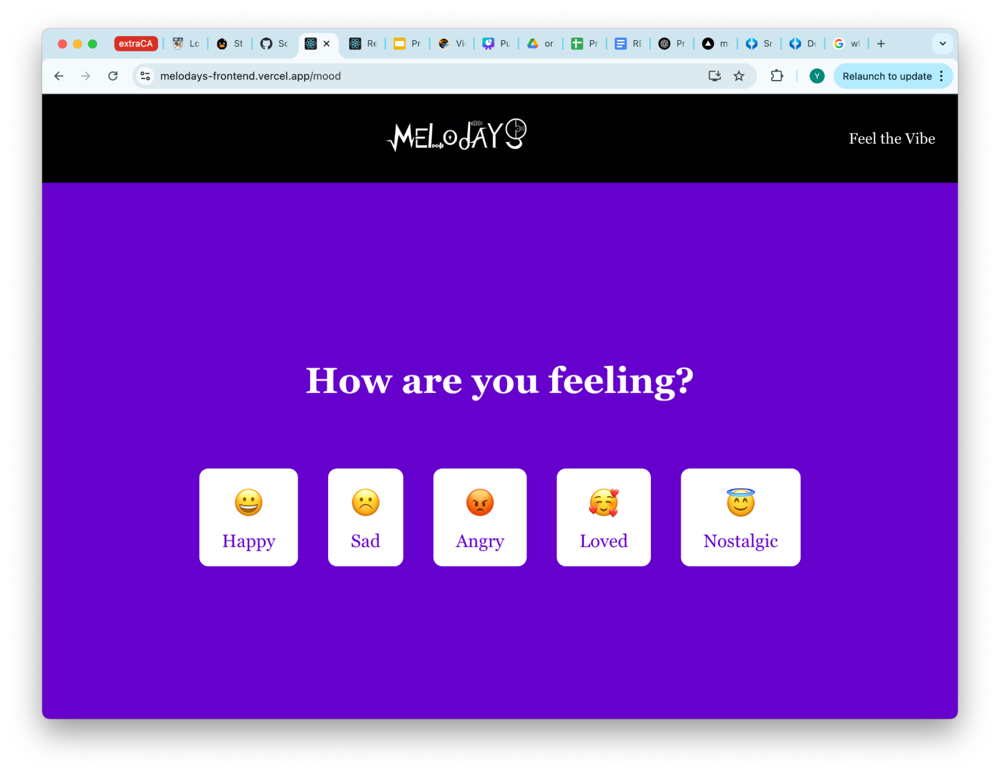
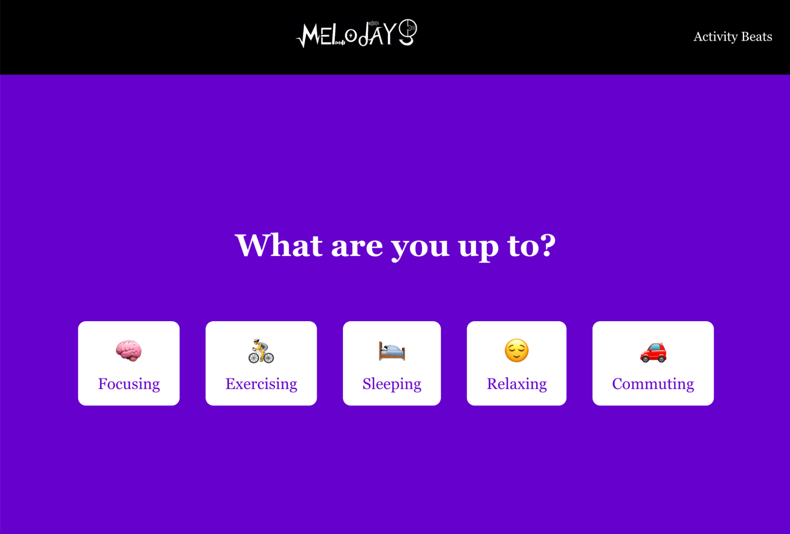
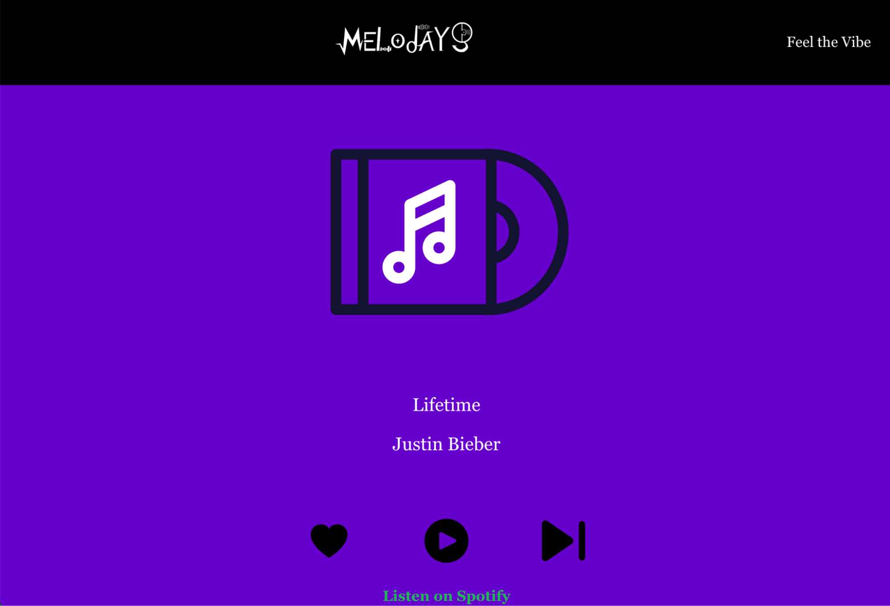
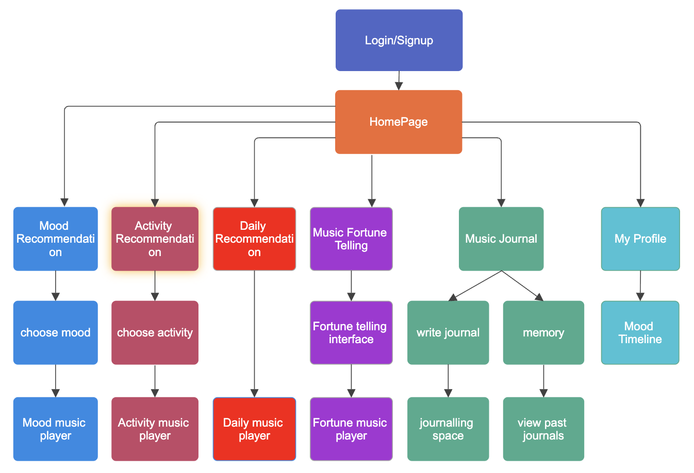
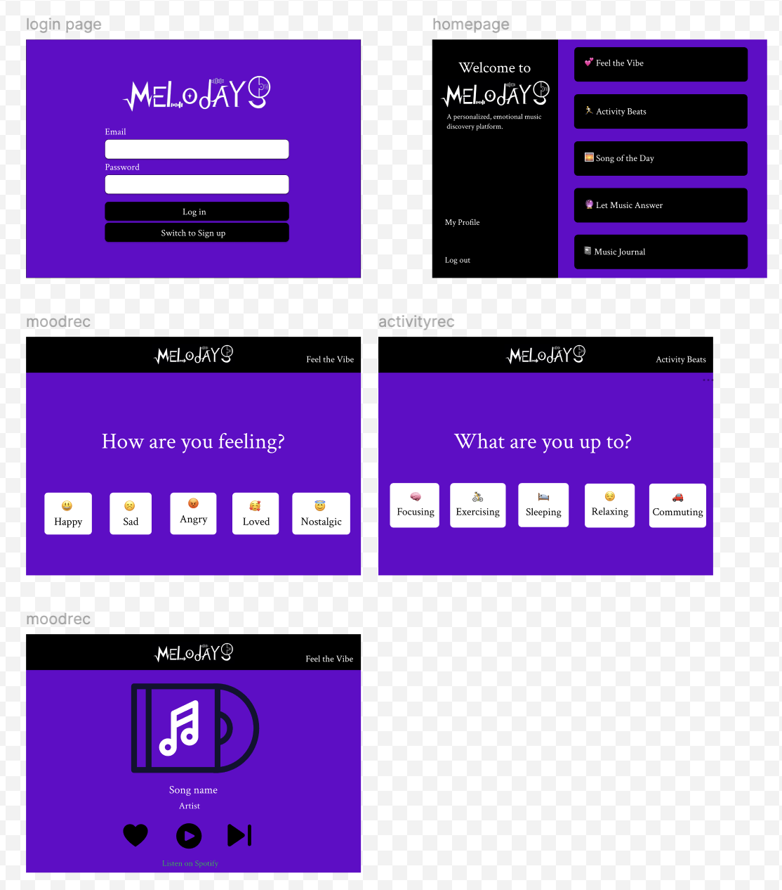
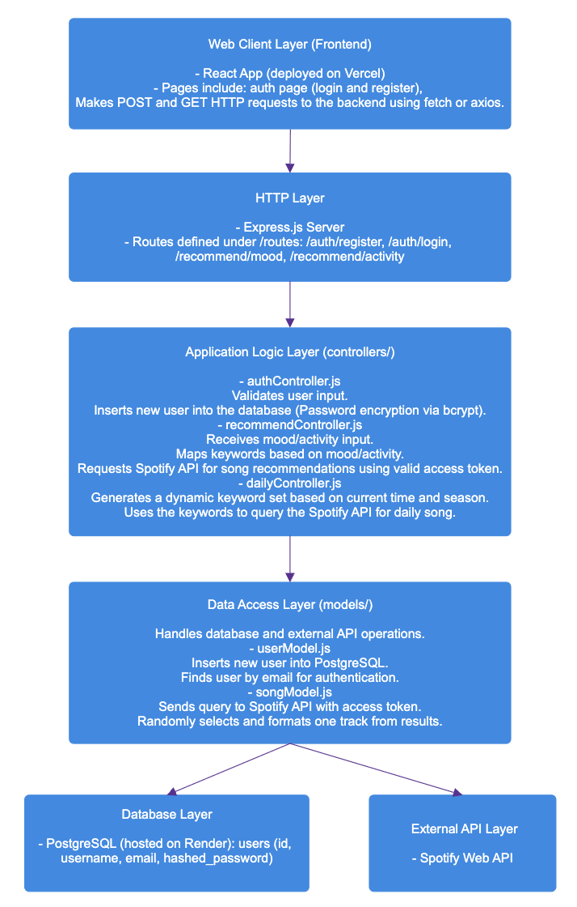

# Melodays

**Proposed Level of Achievement:** Apollo 11

---

## Motivation

These days, we have endless songs at our fingertips — but somehow, finding the right one still feels like a struggle. The one that really gets how we’re feeling, or fits whatever we’re in the middle of doing. Most platforms recommend songs based on what we’ve played before or what’s trending, but that doesn’t always match our mood at the moment.

Sometimes we just want a song that gets us. We want to help users rediscover the joy of stumbling upon the right song at the right time — whether they’re celebrating, coping, focusing, or just existing.

---

## Project Scope

A web platform that helps users discover and reflect on music through mood, activity, and daily experiences.

Melodays is a web-based music discovery and journaling platform that recommends songs based on users' mood or activity, offers daily music suggestions, and introduces interactive features like music fortune-telling and music-based journaling. The goal is to make music discovery more personal, emotional, and fun.

---

## Core Features

### Mood-based song recommendations (working version; will be extended in Milestone 3)

User selects the current mood (e.g. happy, sad, nostalgic), and the system suggests fitted songs.

### Activity-based song recommendations (working version; will be extended in Milestone 3)

User specifies an activity (e.g. sleeping, exercising, studying), and the system suggests appropriate music.

### Daily song recommendations (working version; will be extended in Milestone 3)

User receives a daily curated song recommendation based on trends and personal listening history.

### Music Fortune Telling (planned for Milestone 3)

Inspired by the “Book of Answers”, user asks a random question (e.g. “Will I have a good day?” or “Will I marry my current partner?”), and the system returns a randomly selected song as an answer to that question.

### Music Diary (planned for Milestone 3)

Users can save or tag songs they’ve listened to along with their current mood or activity. This lets them build a personal archive of emotional moments through music.

### Mood Tracking Over Time (planned for Milestone 3)

Each journal entry contributes to a mood timeline. Users can view how their emotional states have shifted across days or weeks, providing a reflective view of their musical and emotional journey.

---

## Tech Stack

- **Frontend:** React.js + React Router + CSS  
- **Backend:** Express.js + Node.js  
- **Database:** PostgreSQL  
- **APIs Used:** Spotify Web API  
- **Hosting:** Vercel (frontend), Render (backend)

---

## User Flow Diagram

---

## Progress Summary

### Liftoff  
**Week 2 of May:** Liftoff preparation and submission

---

### Milestone 1  
**Week 3 of May:**  
- Setup and learning for backend, frontend, and Github  
- Github onboarding

**Week 4 of May:**  
- Implemented minimal working version of mood and activity recommendation  
- Finalized Milestone 1 with README, video, and poster

---

### Milestone 2  
**Week 1 of June:**  
- Discussed implementation strategy for Milestone 2 features

**Week 2 of June:**  
- Backend: Set up PostgreSQL, implemented user auth, explored Spotify API  
- Frontend: Planned UIUX, rebuilt interface, implemented login page

**Week 3 of June:**  
- Backend: Built basic recommendation logic  
- Frontend: Implemented recommendation and music player pages

**Week 4 of June:**  
- Integrated frontend and backend  
- Deployed a working version  
- Finalized Milestone 2 with README, video, and poster

---

## Development Plan for Milestone 3

**Week 1 of July:**  
- Address feedback from Milestone 2  
- Strengthen core features: implement Spotify login, implement like/play/next buttons

**Week 2 of July:**  
- Consider logic for fortune-telling feature  
- Build and test music fortune telling feature  
- Plan and set up structure for music journaling feature (database, frontend layout)

**Week 3 of July:**  
- Build and test music journaling feature  
- Build and test mood timeline

**Week 4 of July:**  
- Continue mood timeline development  
- UX polishing  
- Optimize mood/activity song loading and state handling  
- Conduct user testing  
- Finalize Milestone 3 with README, video, and poster

---

## Frontend Design

[See Figma Design](https://www.figma.com/design/5Tpxucf1Qym4s1L9FN1pmi/Figma-basics?node-id=601-9&p=f&t=3rvVN3L41kaFaB99-0)

- Consistency across pages (header, color, font, button design)  
- User-centric language  
- Clear structure and easy to navigate (minimal text, intuitive icons)  
- Deep purple color palette to reflect the emotional and mysterious nature of Melodays

---

## Layered System Architecture

---

## Problems Encountered

One of the biggest challenges we faced was dealing with Spotify’s limited audio playback support.

At first, we thought it was possible to play short preview clips (30 seconds) of songs through the Spotify Web API. Our plan was to display the recommended song (name + artist), allow a short preview, and also offer a redirect button to open the full song in Spotify.

Everything else was working fine: we could fetch song titles, artists, even the preview URLs. But as we got closer to the milestone deadline, we ran into a major issue: the preview audio just wouldn't play. We confirmed the button logic worked using local mp3 files, but Spotify previews wouldn’t play.

We tried debugging the playback issue extensively — checking state updates, refs, fetch errors, and even Spotify proxy services. In the end, we learned that Spotify’s preview URLs are only available for a very limited set of songs, and many are broken or unsupported in browsers.

The solution is to use Spotify login and their Web Playback SDK to access full song playback — but it was too complex to complete before the deadline.

As a pivot, we ensured the **redirect to Spotify** function works reliably so that users can still listen to full tracks through their own accounts.

Spotify login + full playback is now a core part of our Milestone 3 plan.

---

## Project Link

Check out the live version here:  
[https://melodays-frontend.vercel.app](https://melodays-frontend.vercel.app)